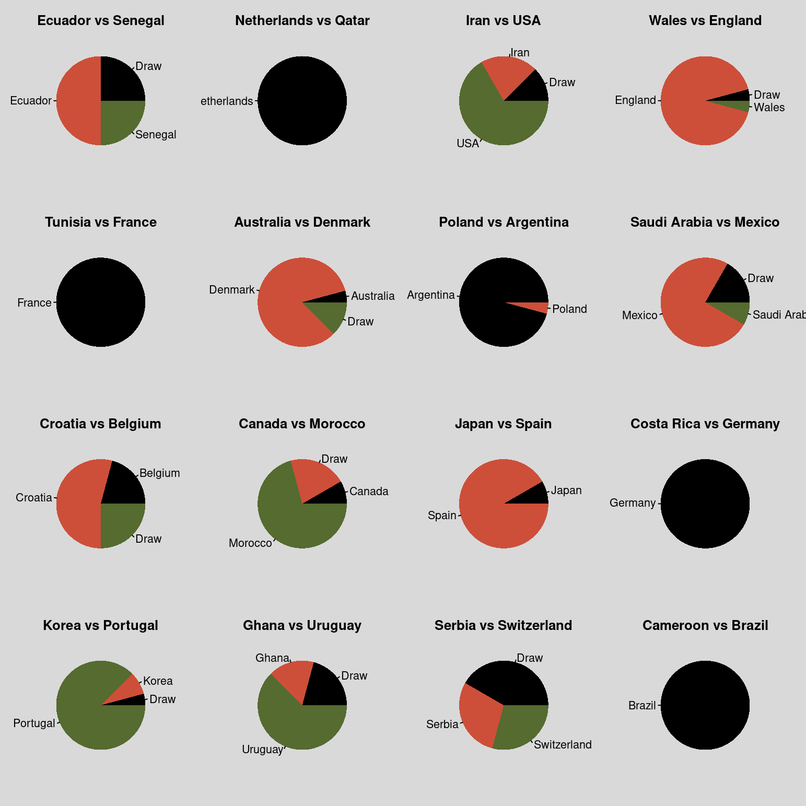

# **Quiniela Qatar 2022**

---
## Bienvenidos

Este es el repositorio de la quiniela Qatar 2022. Aqui se publicarán las picks y los resultados de la quiniela.

---

Última actualización: Sat  3 Dec 2022 04:47:06 EST.

# **Puntuaciones**

### **Tabla General**

| numero_participante | Nombre                        | GS1 | GS2 | GS3 | Total |
| ------------------- | ----------------------------- | --- | --- | --- | ----- |
| 001                 | Jonathan                      | 10  | 7   | 10  | 27    |
| 014                 | Valentin                      | 9   | 8   | 9   | 26    |
| 002                 | Poncho                        | 9   | 9   | 7   | 25    |
| 003                 | Habib                         | 11  | 6   | 7   | 24    |
| 012                 | Ibrahim T                     | 10  | 6   | 8   | 24    |
| 020                 | Luis Angel Llamas Alonso      | 10  | 7   | 7   | 24    |
| 007                 | Claudio                       | 9   | 6   | 8   | 23    |
| 009                 | Luis Temo Marquez             | 9   | 5   | 9   | 23    |
| 019                 | Diego Angeles                 | 8   | 8   | 7   | 23    |
| 006                 | Juan Carlos Avendaño Aguilar | 9   | 5   | 8   | 22    |
| 013                 | Rubén Aguilar Grande         | 9   | 6   | 7   | 22    |
| 016                 | Ernie                         | 8   | 7   | 7   | 22    |
| 010                 | Fosi                          | 8   | 5   | 8   | 21    |
| 011                 | Jacob                         | 6   | 6   | 9   | 21    |
| 015                 | Daniel Jimenez                | 8   | 6   | 7   | 21    |
| 018                 | Eduardo Rafael Palacios Rejón | 8   | 5   | 8   | 21    |
| 004                 | Jalil Rasgado Toledo          | 9   | 5   | 6   | 20    |
| 005                 | Israel torres                 | 7   | 5   | 8   | 20    |
| 017                 | Bobacao                       | 10  | 3   | 7   | 20    |
| 022                 | Colin                         | 6   | 4   | 10  | 20    |
| 024                 | Ahmed Felfel                  | 8   | 7   | 5   | 20    |
| 008                 | Héctor Zepeda                | 7   | 4   | 8   | 19    |
| 021                 | German Jair Sanchez Soto      | 7   | 5   | 7   | 19    |
| 023                 | adamziri                      | 8   | 5   | 6   | 19    |
 

[Resultados de la Jornada 1](GS1_complete_scores.csv)
 
--- 
 

[Resultados de la Jornada 2](GS2_complete_scores.csv)
 
--- 
 

[Resultados de la Jornada 3](GS3_complete_scores.csv)
 
--- 
# **Fase de Grupos**

---

 ## <u>**Picks de la Jornada 3**</u>
 
 
| numero_participante | Nombre                        | Ecuador vs Senegal | Netherlands vs Qatar | Iran vs USA | Wales vs England | Tunisia vs France | Australia vs Denmark | Poland vs Argentina | Saudi Arabia vs Mexico | Croatia vs Belgium | Canada vs Morocco | Japan vs Spain | Costa Rica vs Germany | Korea vs Portugal | Ghana vs Uruguay | Serbia vs Switzerland | Cameroon vs Brazil |
| ------------------- | ----------------------------- | ------------------ | -------------------- | ----------- | ---------------- | ----------------- | -------------------- | ------------------- | ---------------------- | ------------------ | ----------------- | -------------- | --------------------- | ----------------- | ---------------- | --------------------- | ------------------ |
| 001                 | Jonathan Gallego Rudolf       | Ecuador            | Netherlands          | USA         | England          | France            | Denmark              | Argentina           | Mexico                 | Draw               | Morocco           | Spain          | Germany               | Korea             | Uruguay          | Serbia                | Brazil             |
| 002                 | Poncho                        | Ecuador            | Netherlands          | Iran        | England          | France            | Denmark              | Argentina           | Mexico                 | Croatia            | Morocco           | Spain          | Germany               | Portugal          | Uruguay          | Draw                  | Brazil             |
| 003                 | Habib Echanove                | Ecuador            | Netherlands          | Iran        | England          | France            | Denmark              | Argentina           | Mexico                 | Draw               | Morocco           | Spain          | Germany               | Portugal          | Draw             | Draw                  | Brazil             |
| 004                 | Jalil                         | Senegal            | Netherlands          | Iran        | England          | France            | Draw                 | Argentina           | Saudi Arabia           | Belgium            | Draw              | Spain          | Germany               | Portugal          | Uruguay          | Serbia                | Brazil             |
| 005                 | Isra                          | Ecuador            | Netherlands          | USA         | England          | France            | Denmark              | Argentina           | Mexico                 | Croatia            | Morocco           | Spain          | Germany               | Draw              | Ghana            | Switzerland           | Brazil             |
| 006                 | Juan Carlos Avendaño Aguilar | Ecuador            | Netherlands          | USA         | England          | France            | Denmark              | Argentina           | Mexico                 | Belgium            | Canada            | Spain          | Germany               | Portugal          | Uruguay          | Switzerland           | Brazil             |
| 007                 | Claudio                       | Draw               | Netherlands          | USA         | England          | France            | Denmark              | Argentina           | Mexico                 | Draw               | Morocco           | Spain          | Germany               | Portugal          | Ghana            | Draw                  | Brazil             |
| 008                 | Héctor Zepeda Reyes          | Senegal            | Netherlands          | USA         | England          | France            | Denmark              | Argentina           | Mexico                 | Croatia            | Morocco           | Spain          | Germany               | Portugal          | Ghana            | Serbia                | Brazil             |
| 009                 | Luis Temo Marquez             | Draw               | Netherlands          | USA         | England          | France            | Denmark              | Argentina           | Mexico                 | Croatia            | Morocco           | Spain          | Germany               | Korea             | Uruguay          | Draw                  | Brazil             |
| 010                 | Fosi                          | Draw               | Netherlands          | USA         | England          | France            | Denmark              | Argentina           | Mexico                 | Belgium            | Canada            | Spain          | Germany               | Portugal          | Uruguay          | Switzerland           | Brazil             |
| 011                 | Jacob                         | Senegal            | Netherlands          | USA         | Draw             | France            | Denmark              | Poland              | Mexico                 | Croatia            | Morocco           | Japan          | Germany               | Portugal          | Uruguay          | Switzerland           | Brazil             |
| 012                 | Ibrahim T                     | Ecuador            | Netherlands          | USA         | England          | France            | Draw                 | Argentina           | Mexico                 | Croatia            | Draw              | Japan          | Germany               | Portugal          | Uruguay          | Draw                  | Brazil             |
| 013                 | Ruben                         | Draw               | Netherlands          | USA         | England          | France            | Denmark              | Argentina           | Draw                   | Croatia            | Morocco           | Spain          | Germany               | Portugal          | Uruguay          | Serbia                | Brazil             |
| 014                 | Valentin                      | Ecuador            | Netherlands          | USA         | England          | France            | Denmark              | Argentina           | Mexico                 | Draw               | Morocco           | Spain          | Germany               | Portugal          | Uruguay          | Draw                  | Brazil             |
| 015                 | Daniel Jimenez                | Senegal            | Netherlands          | USA         | England          | France            | Denmark              | Argentina           | Mexico                 | Belgium            | Draw              | Spain          | Germany               | Portugal          | Draw             | Serbia                | Brazil             |
| 016                 | Ernie                         | Draw               | Netherlands          | USA         | England          | France            | Denmark              | Argentina           | Mexico                 | Croatia            | Draw              | Spain          | Germany               | Portugal          | Uruguay          | Draw                  | Brazil             |
| 017                 | Bobacao                       | Ecuador            | Netherlands          | USA         | England          | France            | Denmark              | Argentina           | Draw                   | Croatia            | Morocco           | Spain          | Germany               | Portugal          | Ghana            | Switzerland           | Brazil             |
| 018                 | Eduardo Rafael Palacios Rejon | Ecuador            | Netherlands          | Iran        | England          | France            | Draw                 | Argentina           | Mexico                 | Croatia            | Morocco           | Spain          | Germany               | Portugal          | Uruguay          | Switzerland           | Brazil             |
| 019                 | Diego Angeles-Valdez          | Ecuador            | Netherlands          | Draw        | England          | France            | Australia            | Argentina           | Saudi Arabia           | Draw               | Morocco           | Spain          | Germany               | Portugal          | Draw             | Draw                  | Brazil             |
| 020                 | Luis Llamas                   | Draw               | Netherlands          | Draw        | England          | France            | Denmark              | Argentina           | Mexico                 | Croatia            | Morocco           | Spain          | Germany               | Portugal          | Uruguay          | Draw                  | Brazil             |
| 021                 | German Jair                   | Ecuador            | Netherlands          | Draw        | England          | France            | Denmark              | Argentina           | Mexico                 | Croatia            | Morocco           | Spain          | Germany               | Portugal          | Uruguay          | Draw                  | Brazil             |
| 022                 | Colin                         | Ecuador            | Netherlands          | USA         | England          | France            | Denmark              | Argentina           | Mexico                 | Draw               | Morocco           | Spain          | Germany               | Portugal          | Uruguay          | Switzerland           | Brazil             |
| 023                 | Adam                          | Senegal            | Netherlands          | USA         | Wales            | France            | Denmark              | Argentina           | Draw                   | Belgium            | Morocco           | Spain          | Germany               | Portugal          | Draw             | Serbia                | Brazil             |
| 024                 | Ahmed Felfel                  | Senegal            | Netherlands          | Iran        | England          | France            | Denmark              | Argentina           | Draw                   | Croatia            | Draw              | Spain          | Germany               | Portugal          | Draw             | Serbia                | Brazil             |
### Gráficos

### Similitud de las picks

---
### **Jugadores notables en esta ronda**

Este es el top 5 de jugadores que más cambiarán su posición en la tabla tras concluir la ronda: 

| numero_participante | Nombre               |
| ------------------- | -------------------- |
| 004                 | Jalil                |
| 011                 | Jacob                |
| 019                 | Diego Angeles-Valdez |
| 023                 | Adam                 |
| 024                 | Ahmed Felfel         |
 --- 

 ## <u>**Picks de la Jornada 2**</u>
 
 
| numero_participante | Nombre                        | Wales vs Iran | Qatar vs Senegal | Netherlands vs Ecuador | England vs USA | Tunisia vs Australia | Poland vs Saudi Arabia | France vs Denmark | Argentina vs Mexico | Japan vs Costa Rica | Belgium vs Morocco | Croatia vs Canada | Spain vs Germany | Cameroon vs Serbia | Korea vs Ghana | Brazil vs Switzerland | Portugal vs Uruguay |
| ------------------- | ----------------------------- | ------------- | ---------------- | ---------------------- | -------------- | -------------------- | ---------------------- | ----------------- | ------------------- | ------------------- | ------------------ | ----------------- | ---------------- | ------------------ | -------------- | --------------------- | ------------------- |
| 001                 | Jonathan                      | Wales         | Senegal          | Netherlands            | England        | Tunisia              | Poland                 | France            | Argentina           | Japan               | Belgium            | Croatia           | Draw             | Serbia             | Korea          | Brazil                | Draw                |
| 002                 | Poncho                        | Wales         | Senegal          | Netherlands            | Draw           | Tunisia              | Poland                 | France            | Argentina           | Japan               | Draw               | Croatia           | Spain            | Draw               | Korea          | Brazil                | Portugal            |
| 003                 | Habib                         | Wales         | Senegal          | Netherlands            | Draw           | Draw                 | Poland                 | France            | Draw                | Japan               | Belgium            | Croatia           | Spain            | Serbia             | Korea          | Brazil                | Draw                |
| 004                 | Jalil Rasgado Toledo          | Wales         | Senegal          | Netherlands            | England        | Draw                 | Draw                   | France            | Argentina           | Japan               | Belgium            | Draw              | Spain            | Cameroon           | Korea          | Brazil                | Portugal            |
| 005                 | Isra                          | Wales         | Senegal          | Netherlands            | England        | Tunisia              | Draw                   | France            | Draw                | Japan               | Draw               | Canada            | Spain            | Draw               | Ghana          | Brazil                | Draw                |
| 006                 | Juan Carlos Avendaño Aguilar | Wales         | Senegal          | Netherlands            | England        | Tunisia              | Poland                 | France            | Argentina           | Draw                | Belgium            | Draw              | Germany          | Cameroon           | Korea          | Brazil                | Draw                |
| 007                 | Claudio                       | Wales         | Senegal          | Netherlands            | England        | Australia            | Poland                 | France            | Argentina           | Japan               | Belgium            | Canada            | Spain            | Serbia             | Draw           | Brazil                | Draw                |
| 008                 | Héctor Eduardo Zepeda Reyes  | Wales         | Senegal          | Netherlands            | England        | Draw                 | Draw                   | France            | Mexico              | Japan               | Belgium            | Draw              | Spain            | Serbia             | Ghana          | Brazil                | Draw                |
| 009                 | Luis Temo Marquez             | Wales         | Senegal          | Netherlands            | England        | Tunisia              | Saudi Arabia           | France            | Argentina           | Japan               | Belgium            | Croatia           | Spain            | Serbia             | Korea          | Brazil                | Draw                |
| 010                 | Fosi                          | Wales         | Senegal          | Draw                   | England        | Draw                 | Draw                   | France            | Draw                | Draw                | Belgium            | Canada            | Spain            | Draw               | Draw           | Brazil                | Draw                |
| 011                 | Jacob                         | Wales         | Senegal          | Netherlands            | England        | Draw                 | Saudi Arabia           | France            | Mexico              | Japan               | Morocco            | Croatia           | Spain            | Serbia             | Ghana          | Brazil                | Uruguay             |
| 012                 | Ibrahim T                     | Draw          | Senegal          | Netherlands            | England        | Australia            | Draw                   | France            | Draw                | Japan               | Belgium            | Croatia           | Spain            | Serbia             | Korea          | Brazil                | Portugal            |
| 013                 | Ruben Aguilar                 | Wales         | Senegal          | Netherlands            | England        | Tunisia              | Draw                   | France            | Argentina           | Japan               | Belgium            | Croatia           | Draw             | Serbia             | Korea          | Brazil                | Draw                |
| 014                 | Valentin                      | Wales         | Senegal          | Netherlands            | England        | Draw                 | Poland                 | France            | Argentina           | Japan               | Belgium            | Croatia           | Spain            | Draw               | Draw           | Brazil                | Portugal            |
| 015                 | Daniel Jimenez                | Wales         | Senegal          | Netherlands            | England        | Tunisia              | Poland                 | France            | Argentina           | Japan               | Belgium            | Canada            | Spain            | Serbia             | Korea          | Brazil                | Portugal            |
| 016                 | Ernie                         | Wales         | Senegal          | Netherlands            | England        | Tunisia              | Draw                   | France            | Argentina           | Draw                | Belgium            | Croatia           | Draw             | Draw               | Draw           | Brazil                | Draw                |
| 017                 | Bobacao                       | Wales         | Senegal          | Netherlands            | England        | Tunisia              | Draw                   | France            | Draw                | Japan               | Belgium            | Draw              | Spain            | Serbia             | Draw           | Brazil                | Draw                |
| 018                 | Eduardo Rafael Palacios Rejón | Wales         | Senegal          | Ecuador                | England        | Draw                 | Saudi Arabia           | France            | Argentina           | Japan               | Belgium            | Draw              | Spain            | Cameroon           | Korea          | Brazil                | Portugal            |
| 019                 | Diego  Angeles                | Wales         | Senegal          | Draw                   | England        | Tunisia              | Poland                 | France            | Draw                | Japan               | Belgium            | Croatia           | Spain            | Serbia             | Ghana          | Brazil                | Portugal            |
| 020                 | Luis Llamas                   | Wales         | Senegal          | Draw                   | England        | Draw                 | Poland                 | France            | Argentina           | Japan               | Belgium            | Canada            | Germany          | Serbia             | Korea          | Brazil                | Portugal            |
| 021                 | German Jair                   | Wales         | Senegal          | Netherlands            | England        | Australia            | Draw                   | France            | Mexico              | Japan               | Belgium            | Draw              | Spain            | Serbia             | Korea          | Brazil                | Portugal            |
| 022                 | Colin                         | Wales         | Senegal          | Netherlands            | Draw           | Tunisia              | Saudi Arabia           | Denmark           | Mexico              | Japan               | Draw               | Canada            | Germany          | Serbia             | Korea          | Brazil                | Portugal            |
| 023                 | Adam                          | Wales         | Senegal          | Netherlands            | England        | Tunisia              | Draw                   | France            | Argentina           | Japan               | Draw               | Canada            | Spain            | Serbia             | Draw           | Brazil                | Portugal            |
| 024                 | Ahmed Felfel                  | Iran          | Senegal          | Draw                   | England        | Draw                 | Saudi Arabia           | France            | Argentina           | Japan               | Belgium            | Draw              | Spain            | Serbia             | Korea          | Brazil                | Portugal            |

 ## <u>**Picks de la Jornada 1**</u>
 
 
| numero_participante | Nombre                        | Qatar vs Ecuador | England vs Iran | Senegal vs Netherlands | USA vs Wales | Argentina vs Saudi Arabia | Denmark vs Tunisia | Mexico vs Poland | France vs Australia | Morocco vs Croatia | Germany vs Japan | Spain vs Costa Rica | Belgium vs Canada | Switzerland vs Cameroon | Uruguay vs Korea | Portugal vs Ghana | Brazil vs Serbia |
| ------------------- | ----------------------------- | ---------------- | --------------- | ---------------------- | ------------ | ------------------------- | ------------------ | ---------------- | ------------------- | ------------------ | ---------------- | ------------------- | ----------------- | ----------------------- | ---------------- | ----------------- | ---------------- |
| 001                 | Jonathan                      | Draw             | England         | Netherlands            | Draw         | Argentina                 | Denmark            | Draw             | France              | Croatia            | Germany          | Spain               | Belgium           | Draw                    | Draw             | Portugal          | Brazil           |
| 002                 | Poncho                        | Ecuador          | England         | Netherlands            | USA          | Argentina                 | Denmark            | Draw             | France              | Croatia            | Germany          | Spain               | Belgium           | Cameroon                | Uruguay          | Portugal          | Brazil           |
| 003                 | Habib                         | Ecuador          | England         | Netherlands            | Draw         | Argentina                 | Denmark            | Draw             | France              | Draw               | Germany          | Spain               | Belgium           | Draw                    | Uruguay          | Portugal          | Brazil           |
| 004                 | Jalil Rasgado Toledo          | Ecuador          | England         | Netherlands            | Wales        | Argentina                 | Denmark            | Draw             | France              | Croatia            | Germany          | Spain               | Belgium           | Draw                    | Uruguay          | Portugal          | Brazil           |
| 005                 | Israel torres                 | Qatar            | England         | Netherlands            | Draw         | Argentina                 | Denmark            | Poland           | France              | Croatia            | Germany          | Spain               | Draw              | Cameroon                | Uruguay          | Portugal          | Brazil           |
| 006                 | Juan Carlos Avendaño Aguilar | Qatar            | England         | Netherlands            | USA          | Argentina                 | Denmark            | Draw             | France              | Croatia            | Germany          | Spain               | Belgium           | Switzerland             | Uruguay          | Portugal          | Brazil           |
| 007                 | Claudio                       | Qatar            | England         | Netherlands            | USA          | Argentina                 | Denmark            | Draw             | France              | Croatia            | Germany          | Spain               | Belgium           | Switzerland             | Uruguay          | Portugal          | Brazil           |
| 008                 | Héctor Zepeda                | Ecuador          | Draw            | Netherlands            | USA          | Argentina                 | Denmark            | Mexico           | France              | Croatia            | Germany          | Spain               | Belgium           | Draw                    | Uruguay          | Portugal          | Brazil           |
| 009                 | Luis Temo Marquez             | Ecuador          | England         | Netherlands            | USA          | Argentina                 | Draw               | Mexico           | France              | Croatia            | Germany          | Spain               | Belgium           | Cameroon                | Uruguay          | Portugal          | Brazil           |
| 010                 | Fosi                          | Qatar            | England         | Netherlands            | USA          | Argentina                 | Denmark            | Mexico           | France              | Croatia            | Germany          | Spain               | Belgium           | Draw                    | Draw             | Portugal          | Brazil           |
| 011                 | Jacob                         | Qatar            | England         | Netherlands            | Draw         | Argentina                 | Tunisia            | Mexico           | France              | Croatia            | Germany          | Draw                | Belgium           | Cameroon                | Uruguay          | Ghana             | Brazil           |
| 012                 | Ibrahim T                     | Qatar            | England         | Netherlands            | Draw         | Argentina                 | Denmark            | Poland           | France              | Croatia            | Japan            | Spain               | Belgium           | Switzerland             | Korea            | Portugal          | Brazil           |
| 013                 | Rubén Aguilar Grande         | Ecuador          | England         | Netherlands            | Wales        | Argentina                 | Denmark            | Mexico           | France              | Croatia            | Germany          | Spain               | Belgium           | Switzerland             | Uruguay          | Portugal          | Brazil           |
| 014                 | Valentin                      | Qatar            | England         | Netherlands            | Draw         | Argentina                 | Denmark            | Mexico           | France              | Croatia            | Germany          | Spain               | Belgium           | Switzerland             | Uruguay          | Portugal          | Brazil           |
| 015                 | Daniel Jimenez                | Draw             | England         | Netherlands            | USA          | Argentina                 | Denmark            | Mexico           | France              | Croatia            | Germany          | Spain               | Belgium           | Cameroon                | Draw             | Portugal          | Brazil           |
| 016                 | Ernie                         | Draw             | England         | Netherlands            | USA          | Argentina                 | Denmark            | Draw             | France              | Croatia            | Germany          | Spain               | Belgium           | Draw                    | Uruguay          | Portugal          | Brazil           |
| 017                 | Bobacao                       | Ecuador          | England         | Netherlands            | Draw         | Argentina                 | Denmark            | Mexico           | France              | Draw               | Germany          | Spain               | Draw              | Switzerland             | Uruguay          | Portugal          | Brazil           |
| 018                 | Eduardo Rafael Palacios Rejón | Ecuador          | England         | Netherlands            | USA          | Argentina                 | Tunisia            | Mexico           | France              | Croatia            | Germany          | Spain               | Belgium           | Cameroon                | Uruguay          | Portugal          | Brazil           |
| 019                 | Diego Angeles                 | Qatar            | England         | Netherlands            | Draw         | Argentina                 | Denmark            | Mexico           | France              | Croatia            | Germany          | Spain               | Belgium           | Cameroon                | Uruguay          | Portugal          | Brazil           |
| 020                 | Luis Angel Llamas Alonso      | Qatar            | England         | Netherlands            | Draw         | Argentina                 | Draw               | Mexico           | France              | Draw               | Germany          | Spain               | Draw              | Switzerland             | Uruguay          | Portugal          | Brazil           |
| 021                 | German Jair Sanchez Soto      | Draw             | England         | Netherlands            | USA          | Argentina                 | Denmark            | Mexico           | France              | Croatia            | Germany          | Spain               | Belgium           | Draw                    | Uruguay          | Portugal          | Brazil           |
| 022                 | Colin                         | Draw             | England         | Netherlands            | USA          | Argentina                 | Denmark            | Mexico           | France              | Croatia            | Germany          | Spain               | Canada            | Draw                    | Korea            | Portugal          | Brazil           |
| 023                 | adamziri                      | Draw             | England         | Netherlands            | Wales        | Argentina                 | Denmark            | Poland           | France              | Draw               | Germany          | Spain               | Belgium           | Draw                    | Uruguay          | Portugal          | Brazil           |
| 024                 | Ahmed Felfel                  | Qatar            | England         | Draw                   | USA          | Argentina                 | Draw               | Draw             | France              | Morocco            | Germany          | Spain               | Belgium           | Draw                    | Uruguay          | Portugal          | Brazil           |
### Gráficos

### Similitud de las picks

---
### **Jugadores notables en esta ronda**

Este es el top 5 de jugadores que más cambiarán su posición en la tabla tras concluir la ronda: 

| numero_participante | Nombre                   |
| ------------------- | ------------------------ |
| 011                 | Jacob                    |
| 024                 | Ahmed Felfel             |
| 012                 | Ibrahim T                |
| 020                 | Luis Angel Llamas Alonso |
| 017                 | Bobacao                  |
 --- 
